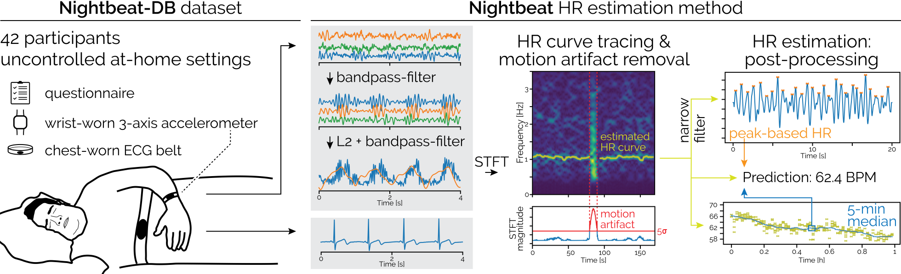
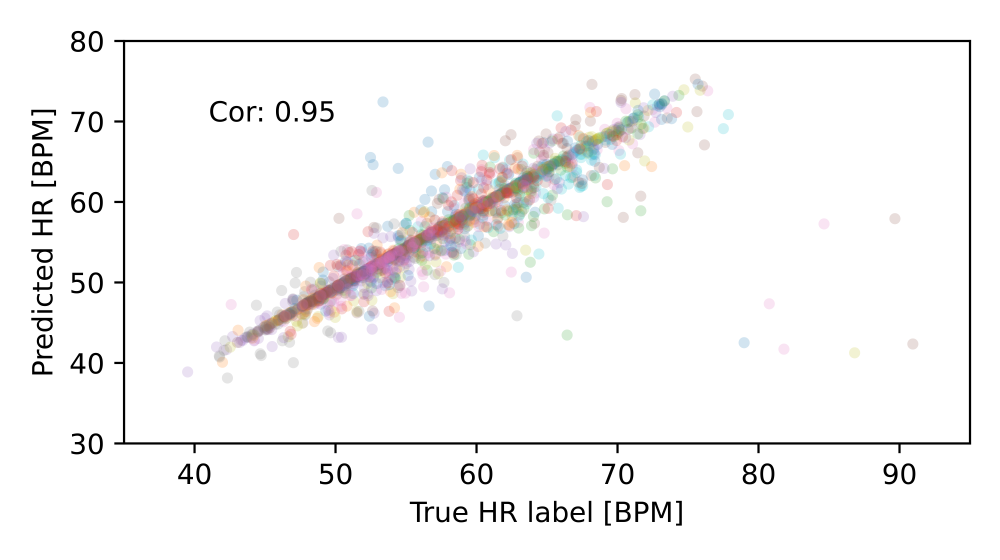
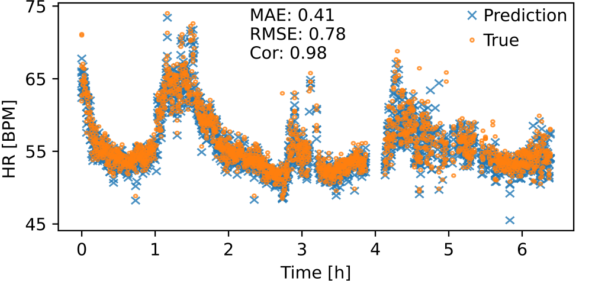

## Nightbeat: Heart Rate Estimation From a Wrist-Worn Accelerometer During Sleep

[Max Moebus<sup>1</sup>](https://maxmoebus.com/), Lars Hauptmann<sup>1</sup>, Nicolas Kopp<sup>1</sup>, Berken Demirel<sup>1</sup>, Björn Braun<sup>1</sup>, [Christian Holz<sup>1</sup>](https://www.christianholz.net)

<sup>1</sup> [Sensing, Interaction & Perception Lab](https://siplab.org), Department of Computer Science, ETH Zürich, Switzerland <br/>

>Today’s fitness bands and smartwatches typically track heart rates (HR) using optical sensors. Large behavioral studies such as the UK Biobank use activity trackers without such optical sensors and thus lack HR data, which could reveal valuable health trends for the wider population. In this paper, we present the first dataset of wrist-worn accelerometer recordings and electrocardiogram references in uncontrolled at-home settings to investigate the recent promise of IMU-only HR estimation via ballistocardiograms. Our recordings are from 42 patients during the night, totaling 310 hours. We also introduce a frequency-based method to extract HR via curve tracing from IMU recordings while rejecting motion artifacts. Using our dataset, we analyze existing baselines and show that our method achieves a mean absolute error of 0.88 bpm—76% better than previous approaches. Our results validate the potential of IMUonly HR estimation as a key indicator of cardiac activity in existing longitudinal studies to discover novel health insights.

# Overview
**Nightbeat-DB:** a novel dataset to enable heart rate monitoring during sleep from wrist-worn accelerometers in *uncontrolled, at-home* settings.<br/>
**Nightbeat:** a novel algorithm that is based on robust signal aggregation and combines effective motion artifact removal, curve tracing of the heart rate in the frequency domain, and simple post processing to push the average error of heart rate estimation from wrist-worn accelerometers during sleep below 1 bpm MAE.



# Results

Comparison of Nightbeat against three baseline approaches on Nightbeat-DB and the AW dataset (Walch et al. [1]). Approaches from related work do not manage to beat Mean-Pred. baseline: predicting each participant's average heart rate across the entire night.

| Approach          | Dataset      | MAE   | RMSE  | Cor  |
|-------------------|--------------|-------|-------|------|
| BioInsights [2]  | Nightbeat-DB | 17.47 | 21.38 | 0.00 |
|                   | AW           | 21.12 | 24.53 | -0.03 |
| Jerks [3]        | Nightbeat-DB | 13.23 | 20.63 | 0.04 |
|                   | AW           | 3.68  | 7.11  | 0.50 |
| PWR [4]          | Nightbeat-DB | 8.83  | 10.91 | 0.22 |
|                   | AW           | 6.05  | 7.77  | 0.37 |
| Base: Mean-Pred.  | Nightbeat-DB | 3.16  | 4.07  | 0    |
|                   | AW           | 2.98  | 4.09  | 0    |
| **Nightbeat (ours)** | **Nightbeat-DB** | **0.88** | **2.24** | **0.81** |
|                   | **AW**       | **1.68** | **3.38** | **0.64** |

Across all participants, the correlation of Nightbeat exceeds 0.95.



For a single participant, the correlation approaches 1 with an MAE as low as 0.41 across the entire night.



# Codebase and Data

We will upload the data and code very soon.

# Follow-up(s)

Stay tuned for follow-up projects that evaluate the value of Nightbeat for disease prediction and advance what we can extract from wrist-worn accelerometers.

# Citation

```bibtex
@INPROCEEDINGS{moebus2024nightbeat,
  title={Nightbeat: Heart Rate Estimation From a Wrist-Worn Accelerometer During Sleep},
  booktitle={2024 IEEE EMBS International Conference on Biomedical and Health Informatics (BHI)},
  author={Moebus, Max and Hauptmann, Lars and Kopp, Nicolas and Demirel, Berken and Braun, Bj{\"o}rn and Holz, Christian},
  year={2024}
}
```

# References

[1] Walch, Olivia. "Motion and heart rate from a wrist-worn wearable and labeled sleep from polysomnography." PhysioNet 101 (2019).

[2] Hernandez, Javier, Daniel J. McDuff, and Rosalind W. Picard. "BioInsights: Extracting personal data from “Still” wearable motion sensors." 2015 IEEE 12th International Conference on Wearable and Implantable Body Sensor Networks (BSN). IEEE, 2015.

[3] Zschocke, Johannes, et al. "Reconstruction of pulse wave and respiration from wrist accelerometer during sleep." IEEE Transactions on Biomedical Engineering 69.2 (2021).

[4] Weaver, R. Glenn, et al. "Jerks are Useful: Extracting pulse rate from wrist-placed accelerometry jerk during sleep in children." Sleep (2024).
